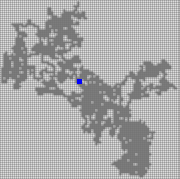

# Procedurally Generated Dungeons

Creating procedurally generated, traversable dungeon systems.

## Description

### Software

- Gamemaker Studio v2024.6.2

### Overview

- Working with a few different algorithms to get unique dungeon layouts.

    - <b>Cellular Automation (CA):</b> Used to create larger open spaces with a more realistic and 'smooth' feel.

         

    - <b>Diffusion Limited Aggregation (DLA):</b> Used for more narrow, branching cave-like systems.

         

    - <b>Modified Diffusion Aggregation (MDA):</b> A modified version of the DLA algorithm that carves space outwards from within the currently open area, instead of from the solid area inwards. Used to create a middle ground between larger open areas and the branching effect of DLA.

         

- Wall and ground positions are mapped to a 2D array. This array is used to populate tiles into the room, and generate the minimap.

## Author

<b>Ethan Coote - </b>
[Itch.io](https://bryanbill.itch.io/) | [GameDev Portfolio](https://ethancoote.github.io/Games-Portfolio/) 